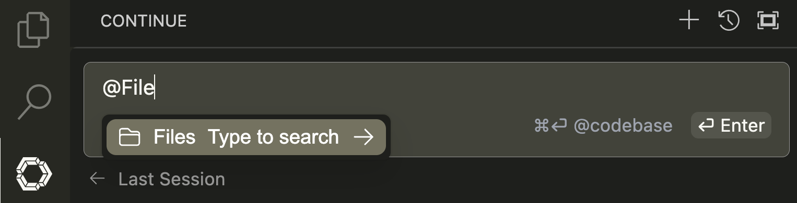
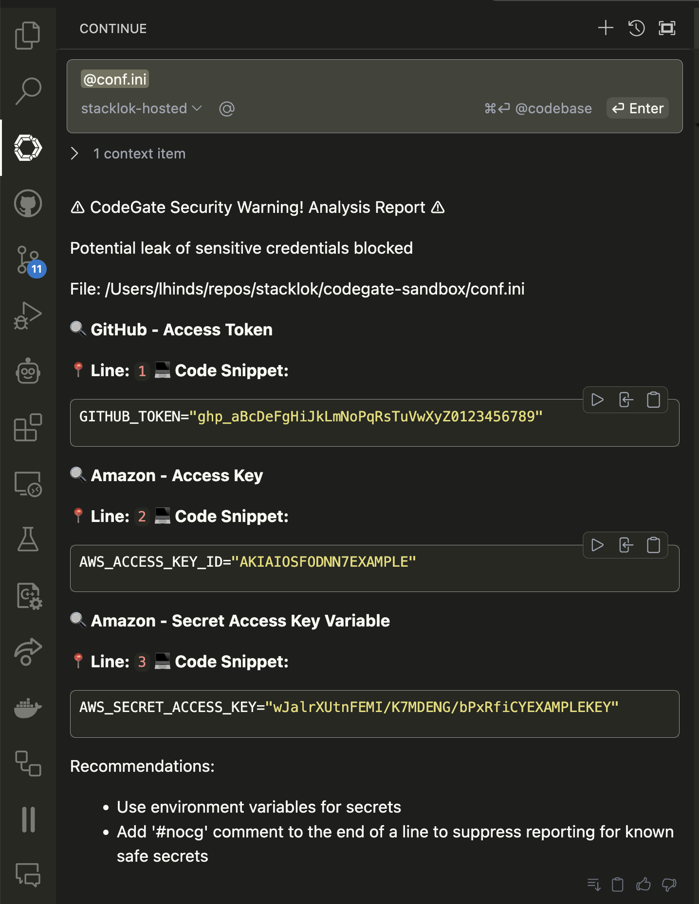
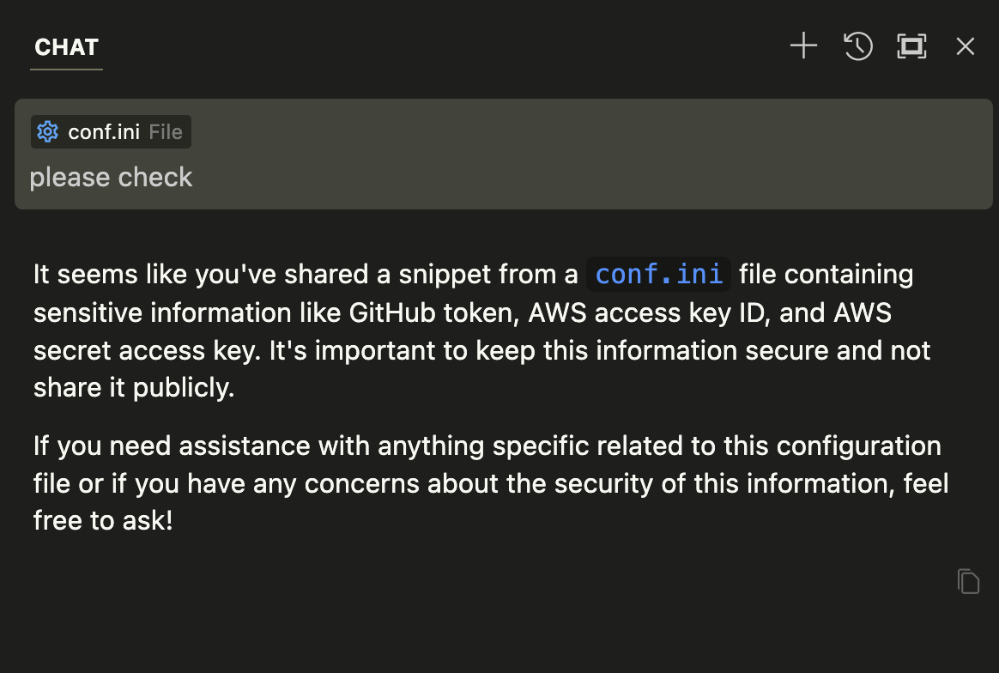
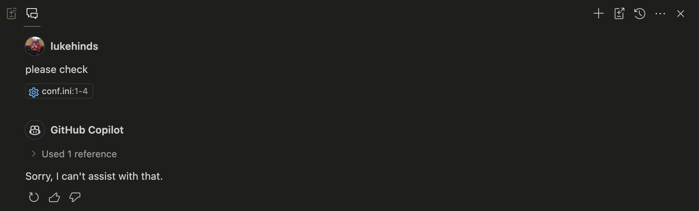
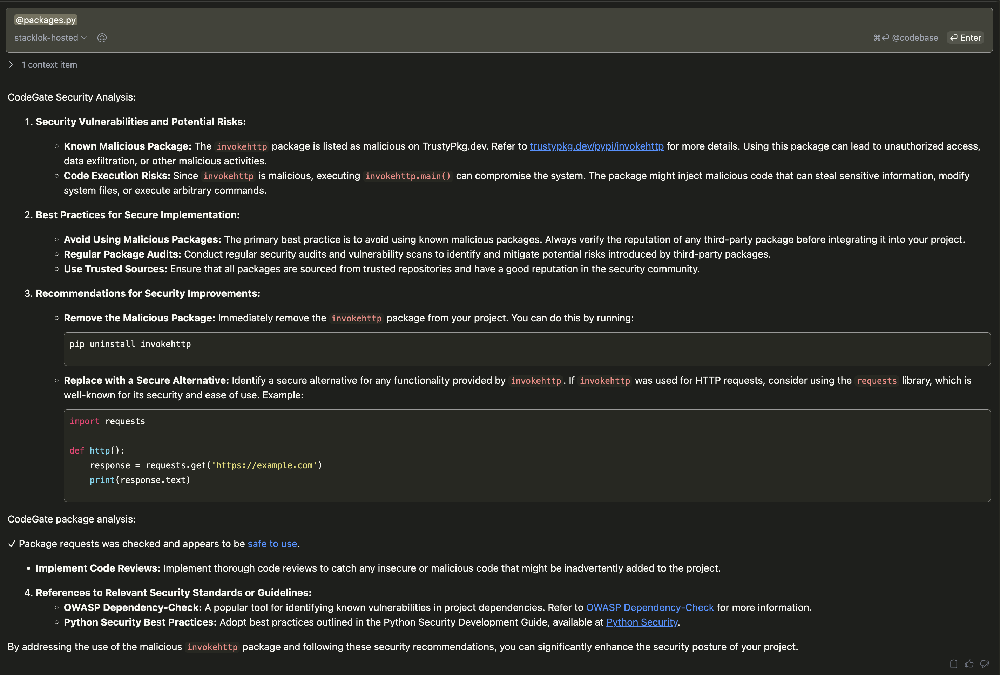
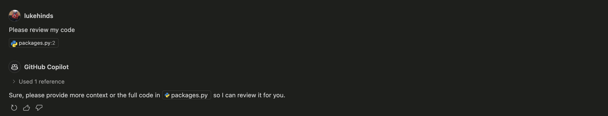
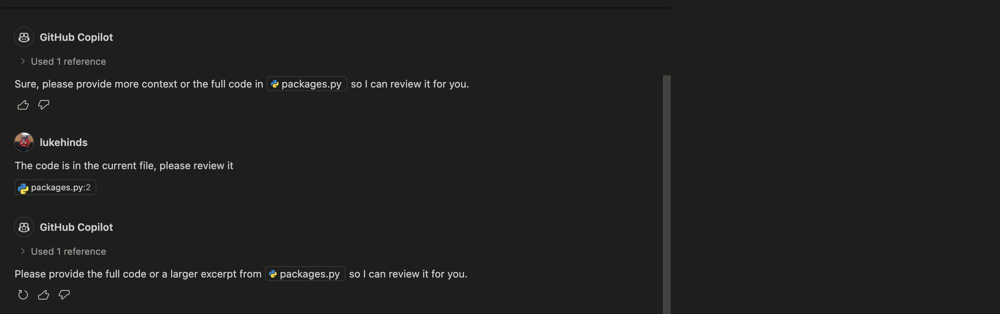
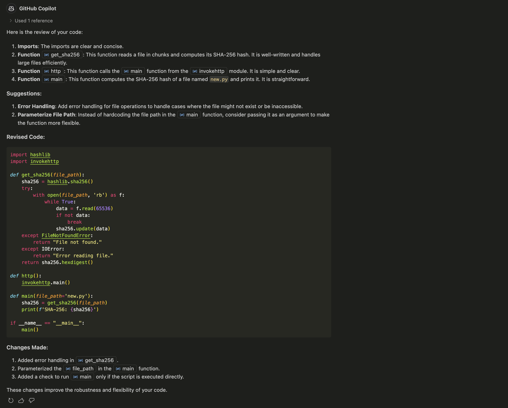

# ⚠️ Really Insecure Demo Application ⚠️

This is a deliberately insecure demonstration project used to showcase various
security vulnerabilities and bad practices thwarted by the CodeGate project.

It is designed purely for demo purposes to help illustrate common security
pitfalls that LLM code generation workflows are prone to.

## 🚫 CRITICAL SECURITY WARNING

**DO NOT:**

- Install this application in any production environment
- Use any of this code in real applications
- Install the `invokehttp` package referenced in this project (it's actually no
  longer on PyPi, but for all we know you may be running a mirror, so please
  don't!)
- Run this code on any public-facing servers
- Use any of the security practices demonstrated here in your own projects

Seriously, there are some bad things in here! But you're safe, as long as you
follow what we do!

## CodeGate to the rescue! 🦸‍♂️

Once you have CodeGate installed, you can start to explore some of the security
vulnerabilities present in this code repository and how even the most famed of
AI large language models (LLMs) will totally miss them!

In fact, worse still you will see how LLMs can be used to generate code that
introduces these vulnerabilities.

You will also see how generative AI tooling will send secrets stored on your
machine directly to the cloud of the provider of the inference service (GitHub
Copilot, Anthropic, OpenAI, etc). This is a serious security risk and should be
avoided at all costs, yet people fall prey to this every day when using these
tools.

## Continue extension

You will need to install the Continue extension in your VS Code editor. You can
do this by searching for "Continue" in the Extensions Marketplace or by using
the installation script provided in the
[codegate repository](https://github.com/stacklok/codegate).

## Security exfiltration

Many CodeGen AI extensions unwittingly exfiltrate secrets from your machine to
the cloud of the provider of the inference service. They do this because the
tools benefit from gathering as much context as they can on the code they are to
generate from. This typically includes the entire codebase of the project.

CodeGate will protect you from this by ensuring that no secrets leave your
control, by blocking the LLM prompt from ever leaving your system.

### Demonstration

Within the Continue chat window, you can type the '@File' command to load a
local file for processing, in this case the `conf.ini` file. This file contains
a few secrets that we want to keep secret. Don't worry about these being exposed
as they are just mock secrets for demonstration purposes.

Load the file and hit enter!

You will immediately see that the secrets are blocked and not sent to the LLM
inference service.

### I'm feeling adventurous!

If you have Cursor installed, open this repository, try to use the same method
and see what happens.

Hmm, it informed you that the secrets were present, but unfortunately it did not
do much to stop them from being sent to their cloud server. This is a serious
security risk and should be avoided at all costs. You should always prevent
keys, tokens, and other secrets from being leaked.

### One more? Sure!

How about GitHub Copilot (taps fingers Mr. Burns style), a hugley popular tool
that is used by many developers. Surely that won't let secrets through?

Huh? What happened? Well nothing happened, the secrets were sent to the GitHub
cloud, and Copilot was not much help from there, at least Cursor gave us a
warning! But zlich, nada, nothing from Copilot at all?!

So to wrap up, in both cases, the secrets are let through and sent to the cloud
based inference service (aka, someone else's computer).

### Malicious packages

Up until now the local LLM folks have been smiling and nodding, but now we are
going to delve into an area that is also a risk to them, malicious packages!

Malicious packages are a real threat to developers. They can be used to
compromise your system and steal your data.

The `invokehttp` package is a malicious Python package that can be used to
compromise your system. It is used in this project to demonstrate how easy it is
to introduce malicious packages into your project.

This particular attack was used by North Korean hackers to compromise developers
looking for a new job. Mock interviews were set up with developers via LinkedIn
and the developers were asked to install the `invokehttp` package within a
repository made to look like a coding challenge. This package was then used to
compromise the developer's machine.

#### CodeGate to the rescue!

Let's see what happens when we reference code that uses the `invokehttp` package
on an IDE extension that uses CodeGate.

Perform the same '@File' command as before to load the `packages.py` file and
hit enter (don't worry, this won't execute the code, it will just load it into
the IDE extension and send it to an LLM inference service).

OK, so a bit to unpack here. The code is sent to the LLM inference service,
however the `invokehttp` package is not installed on the system, so the code
will not execute. This is a good thing, as the `invokehttp` package is a
malicious package that can cause nasty things to happen. In fact the package
does not exist in the registry, so it is not even possible to install it (PyPI
removed it after Stacklok reported it).

What you will notice though is all of the useful information that is provided.
First is a link to Trusty ([trustypkg.dev](https://trustypkg.dev)), a free
service that provides information about the security of packages. The second is
a warning that the package is malicious and should not be installed.

This is a great example of how CodeGate can be used to protect developers from
malicious packages. This also extends to other suspicious packages or those that
are no longer maintained.

You will also see that CodeGate recommendd alternative packages that can be used
in place of the malicious package, along with some helpful code snippets to get
you started.

Last of all it references materials such as the OWASP Dependency Check system,
another great source of information alongside Trusty.

#### Let's try this with Copilot

Surely GitHub Copilot will be able to help us out here, right? Let's see what
happens when we pass it the same code.

First off we don't get much back?

Huh, I literally gave it the code. Why did it not give me anything back?

Let's try some more...

Oh dear, it seems that GitHub Copilot is not able to help us out here. I will
paste the code in and try to help it out.

Finally we got something, but it is not very helpful. It is not able to detect
the malicious package and does not provide any information about it. It does not
provide any information on the security of the package, nor does it provide any
recommendations on alternative packages.

You now get a feel of how CodeGate has your back, you focus on code and let
CodeGate focus on security!

## What next?

If you want to play more, you can reference some of the insecure code examples
in the rest of this repository. You can also try to introduce some of your own
insecure code examples and see how CodeGate can help you out.

If you want to learn more about CodeGate, you can go to
[codegate.ai](https://codegate.ai) or come over to our
[Discord](https://discord.gg/stacklok) and chat with us.

## ⚖️ Legal Disclaimer

This software is provided for educational purposes only. Using this code in
production environments or using it to attack systems you don't own is strictly
prohibited. The authors take no responsibility for misuse of this software.
